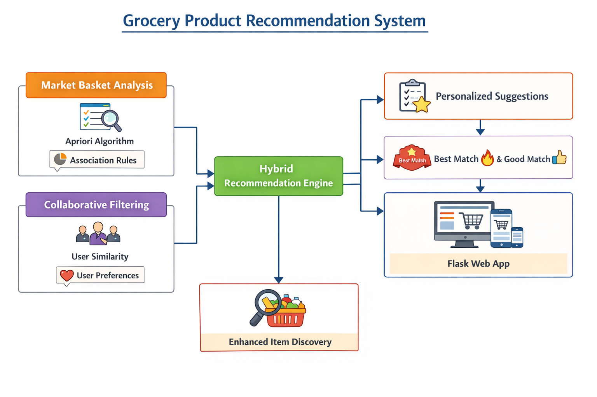

# 🛒 Grocery Product Recommendation System

A smart grocery recommendation system that helps users discover products they’ll love! 

Combines Market Basket Analysis and Collaborative Filtering for personalized recommendations.

Discover what to buy, based on your shopping history and similar customers’ habits!

🔗 Dataset

https://www.kaggle.com/datasets/heeraldedhia/groceries-dataset

This project uses the Groceries Dataset from Kaggle:

Contains transactional data of grocery purchases.

Each transaction represents items bought together by a customer.

🌈 Features at a Glance

🔹 Market Basket Analysis: Uses the Apriori algorithm to find frequent itemsets. Generates association rules to recommend products that are often bought together.

🔹 Collaborative Filtering: Personalized suggestions based on similar users. Provides personalized recommendations based on user similarity.	

🔹 Combines Market Basket Analysis and Collaborative Filtering for more accurate and personalized suggestions.	

🔹 Modern Web UI, Searchable dropdown and typeahead autocomplete for easy product selection. Visual badges like 🔥 Best Match and 👍 Good Match for recommendations.

🗂️ Project Structure

🛠️ Tech Stack

1) Python 3.11 

2) Flask 

3) Bootstrap 5 

4) Pandas & NumPy 

5) Scikit-learn (Collaborative Filtering) 

6) Mlxtend (Apriori Algorithm) 

🚀 Future Enhancements

1) User login & purchase history tracking

2) Real-time product stock updates

3) Explainable recommendations (“Customers who bought this also bought…”)

4) Interactive product cards with images

5) Personalized dashboards & analytics

👨‍💻 Author

Mansi Savdekar

[GitHub Profile](https://github.com/mansisavdekar)

[Connect on LinkedIn](https://www.linkedin.com/in/mansi-savdekar-232577181/)
